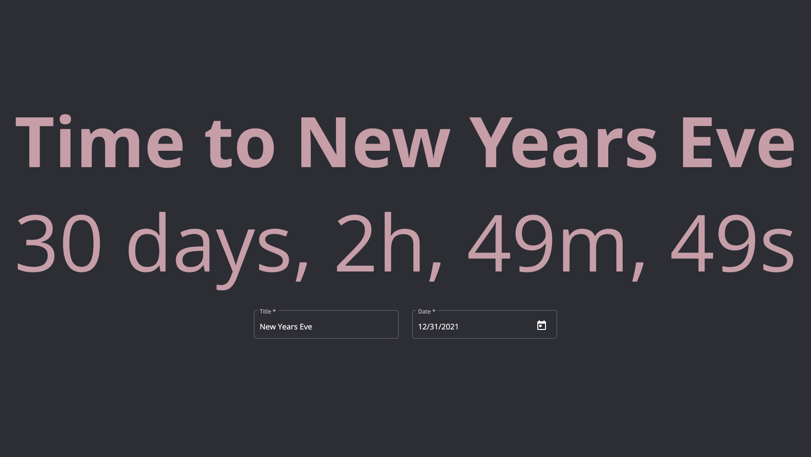

# FitText

Project is built with Angular 13 and Angular Material.  
date-fns is used for Datetime values handling.  

[Hosted on Netlify](https://fit-text.netlify.app/)  
[](https://fit-text.netlify.app/)

## Run locally

```bash
npm i
npm run start
```

Then open browser at [http://localhost:4200](http://localhost:4200)
